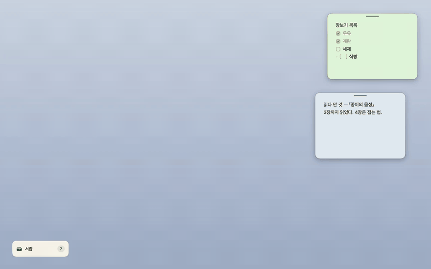
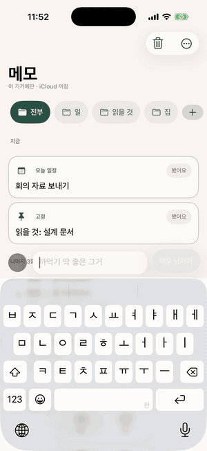

# lazymemo

> macOS 바탕화면에 상주하는 메모 + 캘린더. **사용자는 게으르다**를 전제로 설계했다.
>
> [소개 페이지](https://bunhine0452.github.io/lazymemo/ko/) ([English](https://bunhine0452.github.io/lazymemo/)) · [릴리스](https://github.com/bunhine0452/lazymemo/releases/latest) · [무엇이 바뀌었나](#이번-판-050)

앱을 "열어서" 쓰지 않는다. 메모는 항상 바탕화면에 떠 있고, 새 메모는 `⌥⌘N` 한 번으로 시작되며, **저장 버튼이 없다.** `내일 오후 3시 치과` 라고 적으면 날짜는 앱이 읽는다. 지금 필요 없는 종이는 서랍에 밀어 두고, 정리는 Claude 가 대신한다.

메모는 당신 컴퓨터의 마크다운 파일이다. **가입도 계정도 없고, lazymemo 를 지워도 메모는 남는다.**



> 실제 앱을 화면 기록한 것이다. 손은 앱이 스스로 움직였고(`scripts/record-demo.sh`), 화면의 창은 전부 진짜다. [mp4](site/media/demo.mp4)



> 폰은 시뮬레이터에서 앱이 스스로 움직인 것을 기록했다(`ios/scripts/record-demo.sh`). [mp4](site/media/phone.mp4)

## 이번 판 — 0.8.0

- **서랍이 한 손짓이 됐다.** 줄을 한 번 누르면 종이가 바로 바탕화면으로 돌아오고(바닥에 「도로 넣기」), 글자를 치고 `⏎` 면 찾은 첫 줄이 나온다. 메뉴바 「서랍」은 다른 앱 앞에 **펼친 채** 뜨고 찾기 줄에 커서가 선다. 탭은 커지고 최근 두 장의 제목을 보인다. 종이는 펼친 판 어디에 놓아도 보고 있는 폴더로 들어간다 ([서랍](#서랍--밀어-둔-종이가-가는-자리-그리고-폴더)).
- **메모를 누르고 `esc`** 를 치면 ×와 같이 서랍에 들어가고, 키보드는 쓰던 앱으로 돌아간다. 종이 머리의 색띠는 실제로 끌리도록 고쳤고 살짝 키웠다.
- **「달력」 위젯.** 이번 달 격자에 일정 있는 날의 점 — 작은 것은 오늘 한 칸, 중간은 격자, 큰 것은 격자 아래 「오늘부터」 네 줄 ([위젯](#위젯--홈-화면잠금-화면알림-센터의-지금)).
- **폰 달력을 쓸어 넘기면** 판이 손가락을 따라오고, 놓으면 미끄러져 자리를 잡는다. 화살표·「오늘」·날짜 시트도 같은 움직임.
- **비서의 「웹에서 찾기」** (미리보기, 맥·폰) — 메모에 없으면 권하고, 「웹에서 …」라고 말하면 바로. DuckDuckGo 에 키 없이 질문 한 줄만 나가고, 출처 링크를 단다 ([이 기기의 비서](#이-기기의-비서-선택-미리보기)).

## 0.7.0

- **진짜 위젯.** 아이폰(홈·잠금 화면)과 맥 App Store 판(알림 센터·바탕화면)에 위젯 셋 — **「지금」**(앱의 「지금」 띠 그대로: 오늘 약속·다시 볼 것·고정, 큰 크기엔 다음 일정까지), **「다음 약속」**(가장 가까운 약속의 시각, 가는 길이 적혀 있으면 「18:39 출발 · 2호선」), **「적기」**(누르면 펜). 앱과 같은 마크다운 파일을 읽고, 시각이 바뀌는 순간에 스스로 갱신되며, 누르면 그 메모나 펜으로 간다 ([위젯](#위젯--홈-화면잠금-화면알림-센터의-지금)). GitHub 판(SwiftPM 번들)에는 없다.
- **`lazymemo://` 주소를 폰도 받는다** — `lazymemo://memo/<id>`·`lazymemo://write`·`lazymemo://add?text=…`.
- **종이 머리의 색띠가 손잡이.** 맥의 종이 머리 색띠를 키워 그 줄로 창을 끈다.

## 0.6.4

- **공유 시트에서 적은 약속도 가는 길을 묻는다.** 지도 앱의 「공유」→「lazymemo 에 적기」로 자리가 있는 약속을 남기면, 알림이 「어디서 출발하시나요? 눌러서 답하면 가는 길을 찾아 적어 둘게요」라 말하고 누르면 펜이 그 질문을 세운다. 알림 권한이 없어도(공유 시트는 권한을 묻지 못한다) 앱을 다음에 열면 펜이 묻는다. 맥은 서비스 메뉴·URL 로 들어온 약속에 상자가 바로 묻는다.
- **Spotlight 지문 시험의 깜빡임** — 셋 중 하나꼴로 빨갛던 것을 잡았다(첫 center 를 튜플이 붙들고 있어 둘이 함께 올렸다). 릴리스 워크플로가 이것으로 멈추지 않는다.

## 0.6.3

- **「어디서 출발하시나요?」에 주소로 답해도 된다.** 지번(「신천동29」)이든 도로명(「세종대로 110」)이든 — 주소로 보이면 네이버 지도의 주소 답을 장소보다 먼저 믿는다(「신반포로 176」에 백화점이 아니라 그 번지).
- **폰의 되물음이 유리 위에 앉는다.** 「어디서 출발하시나요?」·「무엇으로 갈까요?」·시각 되물음·결과 한 줄이 목록의 줄 위에 맨 글로 겹쳐 읽기 어렵던 것.

## 0.6.2

- **네이버 지도에서 복사한 그대로.** 「[네이버지도]센트럴시티터미널(호남선)서울 서초구 신반포로 176 센트럴시티https://naver.me/…」처럼 줄바꿈이 사라져 한 줄로 붙어도, 앞뒤에 「22일 오후 3시」를 이어 적어도, 링크 줄 뒤에 말을 붙여도 자리와 약속을 함께 읽는다. 주소의 번지(176)를 날짜로 읽지 않는다. 짧은 링크가 풀린 옛 모양(`lat`·`lng`·`title`)도 읽는다.
- **「22일」— 달을 안 적은 날.** 앞으로 가장 가까운 그 날(오늘 포함)로 읽는다. 지난 날이면 다음 달, 없는 날(30일 달의 31일)이면 그다음 달. 「3일 뒤」「3일 동안」「1일 2회」「일요일」은 그대로 날이 아니다. 「매달 22일」도 된다.

## 0.6.1

- **키는 하나도 없다.** 가는 길의 예비였던 ODsay 키 설정을 뺐다 — 대중교통은 네이버 지도, 택시는 애플 지도, 그뿐이다. 네이버가 답하지 않으면 택시만 잰다.
- **시연 영상** — 소개 페이지의 「가는 길」 절이 폰의 한 바퀴를 보여 준다: 약속을 적고, 출발지를 답하고, 지하철을 골라 카드가 서고, 출발 전 배너.

## 0.6.0

- **약속을 적으면 가는 길을 묻는다.** 「지도 링크 + 수요일 오후 6시반에 밥약속」을 남기면 비서가 **「어디서 출발하시나요?」** — 역 이름·주소·지도 링크·「지금 여기」로 답하면 길을 찾아 **「경로 N개를 찾았어요 — 버스 21분 · 지하철 19분 (환승) · 택시 12분 (약 9,800원). 무엇으로 갈까요?」** 하고 묻고, 고른 길을 메모 끝에 `## 가는 길` 절로 적는다(사람이 읽는 마크다운 — 버스 번호·종류, 타는 곳, 정류장 수, 지하철 노선·방면, 요금, 승차·출발·도착 시각, 환승). 종이에는 길찾기 카드가 서고, **출발 10분 전에** 종이가 나오며 알림이 「18:12 출발 — 강남역에서 2호선 · 14분」이라 말한다. 대중교통은 네이버 지도 웹이 키 없이 답하고 택시는 애플 지도의 어림이다 — 「됐어」면 아무것도 접속하지 않는다 ([가는 길](#약속의-가는-길)). 폰의 시연 영상은 [소개 페이지](https://bunhine0452.github.io/lazymemo/ko/#route)에.
- **자리 이름은 네이버 지도 검색이 먼저.** 애플 지도는 「강남역」을 강남구 한가운데로 줬다 — 「강남역 2호선」의 자리로 잡힌다. 애플은 예비.
- **약속 밑줄에 붙인 링크.** 「금요일 저녁 6시반 밥약속」 아래에 지도 링크를 붙여 넣으면 지도 앱의 공유로 오해해 날짜를 안 읽던 것 — 첫 줄에 날짜가 있으면 약속이다.

## 요구 사항

- macOS 26 (Tahoe) 이상
- Swift 6.2 이상 — **Xcode 불필요**, Command Line Tools 로 빌드된다
  ```sh
  xcode-select --install
  ```

## 설치

```sh
brew tap bunhine0452/lazymemo
brew install --cask lazymemo
```

또는 **소스에서** — 이쪽이 1차 배포 경로다.

```sh
./scripts/build-app.sh     # dist/LazyMemo.app 생성 + 심볼 스트립 + ad-hoc 서명
open dist/LazyMemo.app
```

**지금까지 나간 판은 공증받지 않았다.** (릴리스 워크플로에 Developer ID 서명·공증 길이 들어 있다 — 아래 [배포](#배포)의 시크릿 다섯이 있으면 그 길로 나가고, 없으면 지금처럼 나가되 실행 요약에 그렇게 적힌다. 첫 공증 판이 나가는 순간 아래 문단과 cask 의 딱지 떼기는 지워진다.) 내려받은 앱에는 `com.apple.quarantine` 이 붙고, macOS 15 부터는 우클릭-열기 우회가 사라져 딱지가 붙은 미공증 앱은 「손상되었습니다」로 끝난다. 그래서 cask 가 설치 뒤 그 딱지를 떼어 낸다 — **미봉책이고, Developer ID 를 받는 즉시 사라진다** ([설계문서 §12.2](docs/DESIGN.md)). 믿을 수 없다면 소스에서 빌드하는 쪽이 맞다: 그렇게 만든 앱에는 애초에 딱지가 붙지 않는다.

release 번들은 **70MB**, 내려받는 zip 은 **23MB** 다 — 그중 65MB 가 [이 기기의 비서](#이-기기의-비서-선택-미리보기)를 돌리는 추론 엔진(LiteRT-LM 의 dylib, `Contents/Frameworks/`)이다. 0.4.0 까지는 3.6MB 였고, 엔진이 들어오면서 커졌다. 엔진은 x86_64 슬라이스를 떼어 실행 파일과 같은 arm64 만 남기고(136MB → 65MB), 실행 파일 둘은 서명 직전에 `strip` 으로 디버거용 심볼 이름표를 턴다(10MB → 4MB). dSYM 은 `.build` 에 남아 크래시 로그 심볼화는 그대로 된다. 모델(2.6GB)은 번들에 없다 — 「받기」를 눌러야 온다.

개발 중 반복 실행은 번들 조립 없이도 된다.

```sh
swift run LazyMemo
```

**App Store 판**(준비 중)은 다른 껍데기다 — 샌드박스 안이라 [Claude 연동](#claude-연동-선택)과 자체 업데이트가 없고, 메모 폴더의 기본 자리가 iCloud Drive 의 「LazyMemo」 폴더(아이폰과 같은 자리)다. 대신 **[위젯](#위젯--홈-화면잠금-화면알림-센터의-지금)이 그 판에만 있다** — 이 GitHub 판은 SwiftPM 이 조립한 번들이라 확장(appex)을 품지 못한다. 나머지는 전부 같다 ([설계문서 §12.6](docs/DESIGN.md)). Claude 를 쓰려면 이 GitHub 판을 쓰면 된다.

## 처음 켜면

첫 실행에 「lazymemo 시작하기」 창이 한 장 뜬다. 읽는 안내가 아니라 **만져 보는 안내**다.

| 단계 | 무엇을 해 보나 |
|---|---|
| 01 · 바로 적기 | 연습용 빠른 입력에 한 줄 적고 「남기기」. 실제 상자에서는 이것이 메모 한 장이 된다 |
| 02 · 날짜에 맡기기 | `내일 오후 3시 치과` 를 고쳐 써 보면 **진짜 파서**가 무엇을 날짜로 읽었는지 바로 보여 준다 |
| 03 · 서랍 사용하기 | 종이를 서랍에 넣었다 꺼내 본다. 실제 메모의 × 가 하는 일이 이것이다 |
| 04 · 준비 완료 | 메뉴바 좌클릭·우클릭·단축키 셋을 적어 두고 「첫 메모 적기」 또는 「달력 열기」 |

연습한 글은 어디에도 저장되지 않는다. 「건너뛰고 메모 적기」로 언제든 빠져나올 수 있고, 메뉴 → **「시작하기 및 사용 안내…」** 로 다시 연다 — 그때는 지금 설정된 단축키로 다시 시작한다.

## 쓰는 법

| | |
|---|---|
| `⌥⌘N` | 빠른 입력. **메뉴바 아이콘 밑에 말풍선으로 뜬다.** 치면 기존 메모가 걸러진다 — **첫소리로도 찾는다**, `ㅈㅂㄱ` 가 「장보기」를 찾는다. 단축키는 메뉴 → 설정에서 바꿀 수 있다 |
| `⌥⌘V` | **클립보드 즉시 메모.** 복사한 글이나 사진을 창을 열지 않고 바탕화면에 바로 새 종이로 꽂는다 |
| `⏎` | 다음 줄. 메모는 한 줄로 끝나지 않는다 |
| `⌘⏎` 또는 **「메모 남기기」** | 적기 끝. 날짜가 읽혔으면 버튼이 「달력에 남기기」로 바뀐다. 찾은 메모를 고른 상태면 그 메모를 연다 |
| 빈 상자의 **`#사진` · 링크 · 할 일** | 그 종류의 메모만 걸러 본다. 글자를 치기 전에 손으로 고르는 길이다 |
| `⌘⌫` | **고른 메모 지우기.** 빠른 입력의 목록에서 — 상자는 닫히지 않고 바로 아래 줄에 「되돌리기」가 생긴다 |
| 목록 끝에서 `↓` 한 번 더 | **「… 외 N장 더」를 펼친다.** 다섯 줄에서 스무 줄로 넓어지되 상자가 화면 밖으로 자라지 않고 안에서 스크롤된다. 키보드로 고른 줄을 따라간다 |
| `esc` 또는 `×` | 닫기. **적던 글은 상자가 기억한다** — 다시 열면 그대로 있고 전부 선택돼 있어 그냥 치면 덮어쓴다. **앱을 껐다 켜도, 판을 갈아도 남는다** (메모가 아니라 초안이라 파일에는 안 쌓인다) |
| 메뉴바 아이콘 **좌클릭** | 빠른 입력 |
| 메뉴바 아이콘 **우클릭** | 메모 목록 · 달력 · 되돌리기 · 시작하기 · 메모 폴더 열기 |
| 목록(메뉴·빠른 입력)의 메모 줄 **오른쪽 휴지통** | 지우기. 바로 아래 줄에 「되돌리기」가 생긴다 |
| 메모 창 드래그 | 어디를 잡아도 끌린다. 가장자리로 크기 조절 |
| 메모 창 `×` | **서랍에 넣는다. 삭제가 아니다.** 서랍이나 메뉴에서 다시 꺼낸다 |
| 메모를 누르고 `esc` | 같은 것 — **서랍에 넣고** 키보드를 원래 쓰던 앱으로 돌려준다. 한글 조합 중이나 방금 지운 종이의 「되돌리기」가 떠 있을 땐 아무 일도 안 한다 |
| 메모 머리의 **색띠** | 손잡이 — 자리 카드가 선 종이도 여기를 잡으면 끌린다. 우클릭은 그대로 종이 메뉴 |
| 메모 위 **붉은 휴지통** | 지우기. **종이는 그 자리에 남아 8초 동안 「되돌리기」를 든다.** 그 뒤로도 30일 안에 되돌릴 수 있다 |
| 메모 위 **달력 아이콘** | 날짜가 없으면 **달력에 놓기** — 달력이 열리고, 칸을 하나 누르면 그 날로 간다. 날짜가 있으면 그 일정이 달력의 어디에 있는지 펼쳐 보여준다 |
| 사진 위에 포인터 | 원본 크기로 펼쳐 본다 |

### 달력 — 만지는 물건

메모와 일정을 따로 만들지 않는다. `due`(날짜) 또는 `at`(시각) 칸이 채워진 메모가 곧 일정이고, 빠른 입력에 `내일 3시` 라고 적거나 종이의 달력 아이콘으로 놓거나 Claude 가 MCP 로 고치거나 — **어느 길로 날짜가 붙든 같다.**

| | |
|---|---|
| 큰 달 이름 옆 `‹` `›` · **오늘** | 달을 넘기고, 오늘로 돌아온다. 늘 보인다 |
| 칸 **누르기** | 그 날의 일정이 아래(가로 창이면 오른쪽)에 펼쳐진다 |
| **「이 날에 적기」** | 고른 날짜가 이미 붙은 새 메모를 시작한다 |
| 일정 줄 위 **「미루기」/「종이로」/휴지통** | 하루 미루거나, **날짜를 떼어 바탕화면 종이로 돌려보내거나**, 지운다. 셋 다 아래에 「되돌리기」가 8초 남는다 |
| 일정을 **다른 칸으로 끌기** | 그 날로 옮긴다. 달과 날이 한 창에 있어야 이것이 한 동작이 된다 |
| 창을 **늘리기** | 판형이 둘이다. 세로 창은 위에 달·아래에 그 날, 가로 창은 왼쪽에 달·오른쪽에 그 날. 5주 달과 6주 달을 오가도 일정 영역이 흔들리지 않는다 |

**날짜가 붙으면 자리가 바뀐다.** 날짜 없는 메모는 바탕화면의 종이로 있고, 날짜가 붙는 순간 종이는 물러나고 달력이 맡는다. 날짜를 떼면 종이가 잠깐 앞으로 나왔다 도로 내려앉는다.

### 다시 보기 — 필요할 때 다시 펼쳐 준다

대충 적어 두고, 다시 볼 시각만 정한다. 종이의 우클릭 메뉴 「다시 보기…」(폰은 편집 화면의 종 단추)에서 시각을 고르거나 「한 시간 뒤」·「내일 아침 9시」를 누른다. **일정은 그대로다** — 회의는 3시, 다시 보는 건 2시 반. 해제하면 따로 정한 시각만 빠지고, 일정 시각이 있으면 그때 알린다고 화면이 적는다.

그 시각에 맥은 종이를 앞으로 꺼낸다. **시스템 알림은 켠 기기에서만** — 「이 기기에서 알림 받기」를 켜면 그때 한 번 권한을 묻고, 그 뒤로 일정 시각과 다시 볼 시각에 알림이 오며 누르면 그 메모가 열린다. 잠금 화면에 메모 제목이 보인다는 것을 켜기 전에 적어 둔다. 날짜만 있는 메모에는 아침 알림을 지어내지 않고, 지운 것·치워 둔 것·다 체크한 목록은 걸지 않는다. 알림은 이 앱이 파일을 읽은 기기에서 걸리므로 — 폰이 꺼진 동안 맥에서 적은 것은 폰이 다시 읽은 뒤에 걸린다. 양쪽에서 켜면 양쪽에서 울릴 수 있고, 집중 모드와 시스템 설정에 따라 전달이 달라진다. 서버가 없으니 기기 간 알림 동기화를 약속하지 않는다.

폰의 목록 위에는 **「지금」** 최대 세 장 — 오늘 다시 볼 것·오늘 일정·고정한 것 중에서 **다가오는 시각부터**, 그다음 방금 지난 것, 그다음 시각이 없는 것. 이유와 시각이 함께 적히고, 띠에 오른 것은 아래 「나머지」 목록에서 빠진다. 「봤어요」로 내려놓으면 이 기기에서만 사라지고, 시각을 미루거나 날이 바뀌면 다시 오른다. 찾는 중이거나 폴더를 골랐을 때는 띠가 없다. 계획과 경계는 [docs/RECALL_PLAN.md](docs/RECALL_PLAN.md).

### 서랍 — 밀어 둔 종이가 가는 자리, 그리고 폴더

바탕화면 왼쪽 아래에 **「서랍 N」 탭**이 하나 앉아 있다 — 둘째 줄에 최근 두 장의 제목이 살짝 보인다. × 나 `esc` 로 치운 종이와 스스로 물러난 종이가 거기 있다. 안은 **폴더**로 나뉜다 — 「장보기」·「읽을 것」·「집」처럼 이름을 짓고, 종이를 그리로 넣는다. 폴더는 서랍의 칸이지 자리가 아니다: 폴더에 넣는 것은 곧 서랍에 넣는 것이고, 꺼낸 종이도 이름표는 그대로라 다시 넣으면 같은 칸으로 돌아간다. 이름표는 파일의 `folder:` 한 줄에 적혀 Claude(MCP)도 같은 것을 본다.

| | |
|---|---|
| 탭을 **누르기** · 메뉴바 **「서랍」** | 펼쳐서 **앞으로** 나온다 — 다른 앱이 앞에 있어도. 메뉴바로 열면 찾기 줄에 커서까지 선다. 다시 누르면 접히며 바탕화면으로 내려앉고 키보드는 쓰던 앱으로 돌아간다. `⌥` 를 누른 채 메뉴를 열면 「서랍 치우기/내놓기」 — 바탕화면에서 아예 치우거나 다시 놓는다 |
| 줄을 **누르기** · `⏎` | **꺼낸다.** 종이가 제자리로 돌아가 잠깐 앞에 선다. 바닥 줄에 「「x」 꺼냈습니다 · **도로 넣기**」가 뜬다 — 잘못 눌렀으면 그걸로. 접으면 사라진다 |
| **글자 치고** `⏎` | 짚지 않아도 **찾은 첫 줄**을 꺼낸다 (그 줄이 미리 밝혀진다). 제목과 본문에서 거르고 **첫소리로도 찾는다** — `ㅈㅂㄱ` 가 「장보기」를 찾는다. 못 찾으면 «비었다» 가 아니라 «N장 중 없다» 고 말한다 |
| 줄의 **˅** · `Space` | 펼쳐서 **읽기만** 한다. 한 번 더 누르면 접힌다. 고치려면 꺼낸다 |
| 종이를 **탭이나 펼친 판 어디에나** 끌어다 놓기 | 넣는다. 끌고 오는 동안 판 전체가 「놓으면 「폴더」에 들어옵니다」라고 말한다 — **보고 있는 폴더로 간다** |
| 종이 **우클릭 → 「서랍에 넣기」** | 폴더를 골라 바로 넣는다 |
| 폴더 띠의 **「+ 새 폴더」** | 이름을 적고 `⏎`. 칩을 **우클릭**하면 이름 바꾸기·폴더 지우기 (지워도 종이는 서랍에 남는다) |
| 목록의 줄을 **폴더 칩으로 끌기** | 그 폴더로 옮긴다. 줄에 손을 얹으면 **꺼내기 · ˅ · 폴더 · 지우기**가 나온다 |
| `⌘` **누른 채 누르기** · `⇧↑` `⇧↓` | 여러 장 고르기. 바닥 줄에 「모두 꺼내기 · 옮기기 · 지우기」가 뜬다 |
| `↑` `↓` · `Tab` | 목록을 훑는다 (끝에서 감아 돌지 않는다) · 옆 폴더로 |
| `⌘⏎` / `⌘⌫` | 짚은 줄을 꺼내기 / 지우기 |
| `⌘F` | 찾기 줄로 |
| `esc` | **한 겹씩 되돌린다** — 고르기 → 찾기 → 펼친 줄 → 짚은 자리 → 폴더 → 서랍 |
| 목록이 길면 | 스크롤한다. 창은 화면이 허락하는 데까지만 자란다 |

**끝난 것은 스스로 물러난다.** 칸을 전부 체크한 목록은 마지막으로 손댄 지 사흘 뒤, 지난 일정은 그 다음 날이 끝나면 바탕화면과 목록에서 빠진다. **지운 것이 아니다** — 파일에도 검색에도 달력에도 그대로 있고, 메뉴가 「치워 둔 N장」이라고 적어 둔다. 거기서 한 번에 도로 꺼낼 수 있고, 빠른 입력에서 찾아 열어도 그 자리에서 도로 나온다. 고정한 메모는 이 규칙이 건드리지 않는다.

### 메모는 어디에 있나

```
~/Documents/lazymemo/
  notes/2026/09/01K3ZQ....md   ← 정본. Finder 로 열어도, 텍스트 에디터로 고쳐도 된다
  .trash/                       ← 삭제한 메모 (30일 보존)
```

이 폴더를 iCloud Drive 안으로 옮기면 동기화가 된다. 별도 백엔드가 없다.

**아이폰과 같이 보려면 메뉴 → 설정 → 「iCloud 로 동기화…」다.** 메모가 iCloud Drive 의 **「LazyMemo」 폴더**(앱 전용 컨테이너의 `Documents/`)로 들어가고, 아이폰의 lazymemo 가 같은 폴더를 본다 — 계정도 서버도 없다. 거기 이미 아이폰이 적어 둔 메모가 있으면 합친다(파일 이름이 ULID 라 겹치지 않는다). 소스에서 지은 앱은 아이폰의 lazymemo 가 한 번 켜진 뒤에야 그 폴더가 생긴다.

**다른 폴더로 옮기는 것은 메뉴 → 설정 → 「메모 폴더 옮기기…」다.** 폴더를 하나 고르면 앱이 상황을 보고 정한다 — 고른 자리에 이미 메모가 있으면(Finder 로 벌써 옮겨 둔 경우) 파일을 건드리지 않고 그것을 쓰고, 없으면 지금 폴더를 통째로 그리로 옮긴다. 어느 쪽인지는 누르기 전에 알려 주고, 끝나면 앱이 다시 열린다. 옮겨 둔 폴더를 나중에 못 찾으면(외장 디스크를 안 꽂았다든가) 기본 폴더로 돌아가되 **메뉴가 그렇게 적어 둔다** — 조용히 빈 폴더를 만들지 않는다.

`~/Library/Application Support/lazymemo/` 아래는 전부 파생물이다 — 통째로 지워도 위 폴더만 있으면 복원된다.

## 어디서든 던지기

메모는 앱 안에서만 만들어지지 않는다. 문이 넷이고, **어느 문으로 들어와도 같은 규칙으로 읽힌다** — `내일 3시` 는 일정이 되고 `@강남역` 은 장소가 된다.

| 어디서 | 어떻게 |
|---|---|
| 다른 앱 | 글자를 고르고 **우클릭 → 서비스 → 「lazymemo 에 적기」** |
| 터미널·cron·스크립트 | `/Applications/LazyMemo.app/Contents/MacOS/lazymemo-mcp add "내일 3시 치과 @강남역"` |
| Raycast·Alfred·단축어 | `open "lazymemo://add?text=장보기"` |
| 아이폰 | **lazymemo 앱** — 공유 시트의 「lazymemo 에 적기」, 홈 화면의 「적기」 [위젯](#위젯--홈-화면잠금-화면알림-센터의-지금), `open "lazymemo://add?text=장보기"` 단축어, 또는 앱 없이 단축어 (아래) |

터미널에서 자주 쓸 거라면 별칭을 하나 두면 짧아진다.

```sh
alias lazymemo='/Applications/LazyMemo.app/Contents/MacOS/lazymemo-mcp'
lazymemo add "우유 사기"
```

**지도 앱에서 장소를 던져도 된다.** 네이버 지도·카카오맵·구글 지도·애플 지도의 「공유」가 내놓는 `이름 · 주소 · 링크` 서너 줄은 어느 문으로 들어와도 첫 줄이 장소가 된다 — `[네이버 지도]` 같은 이름표만 떼고 나머지는 종이에 그대로 남아, 링크는 카드로 펼쳐지고 장소 자국을 누르면 시스템 지도가 열린다. 주소 안에 좌표가 적힌 긴 링크(구글의 `/maps/place/…/@위도,경도`, 카카오의 `link/map/이름,위도,경도`, 애플의 `?ll=`)면 좌표까지 읽어 「가면 떠오르기」에도 걸린다. 폰 앱이 내놓는 짧은 링크(`naver.me`·`kko.to`·`maps.app.goo.gl`)에는 좌표가 적혀 있지 않아 이름까지만 된다 — 그것을 풀려면 접속해야 하고, 그러지 않는다.

### 아이폰 — 같은 폴더를 보는 앱

`ios/` 에 iPhone 앱이 있다. **맥과 같은 메모 파일을 같은 폴더에서 본다** — 맥에서 「iCloud 로 동기화…」를 누르면 그 폴더가 iCloud Drive 의 「LazyMemo」이고, 아이폰은 켜는 순간 그것을 찾는다. 파일이 정본이라는 약속은 폰에서도 같다: 폰이 적은 `.md` 가 맥의 바탕화면에 새 종이로 서고, 맥이 고친 파일이 폰에 그대로 온다. 두 기기가 같은 메모를 따로 고쳤으면 늦게 고친 쪽이 남고 진 쪽은 휴지통에 간다 — 글은 사라지지 않는다.

폰에는 바탕화면이 없으므로 종이도 서랍도 없다. 있는 것은 **펜**(바닥, 적기와 찾기), **무더기**(한 목록), **달력**이다. 화면의 규칙은 [`docs/MOBILE_DESIGN.md`](docs/MOBILE_DESIGN.md) 에 있다. 다른 앱에서 글을 고르고 공유 → 「lazymemo 에 적기」가 맥의 서비스 메뉴와 같은 문이고, 펜의 핀은 **누를 때만** 지금 자리를 재어 붙인다.

iCloud 가 꺼져 있으면 폰은 자기 안에만 적고 화면 바닥에 그렇게 적어 둔다 — 조용히 로컬로 떨어지지 않는다.

Xcode 로 연다: `open ios/LazyMemo.xcodeproj`. 시뮬레이터에서 조작 경로를 손 없이 도는 것은 `./ios/scripts/uitest.sh` 다.

### 위젯 — 홈 화면·잠금 화면·알림 센터의 「지금」

앱을 열지 않아도 오늘 볼 것이 보인다. 아이폰과 **맥 App Store 판**이 같은 위젯 확장 하나(`ios/LazyMemoWidgets`, 번들 id `….lazymemo.widgets`)를 품고, 넷이 있다.

| 위젯 | 무엇 | 크기 |
|---|---|---|
| **지금** | 앱의 「지금」 띠 그대로 — 오늘 다시 볼 것·오늘 일정·고정, 다가오는 것부터 세 장 (`Recall.nowCards`). 작은 것은 한 장, 중간은 세 장, 큰 것은 세 장 아래 「다음」 — 오늘 뒤에 올 일정 여섯 줄까지. 카드를 누르면 그 메모가 열린다 | 작게·중간·크게 · 잠금 화면 네모·한 줄 |
| **다음 약속** | 시각이 적힌 것 중 가장 가까운 한 장 — 큰 글자가 시각, 그 아래 제목. 가는 길을 적어 두었으면 **「18:39 출발 · 2호선」**, 아니면 남은 시간이 흐른다 | 작게 · 잠금 화면 네모·동그라미·한 줄 |
| **적기** | 누르면 펜이 올라온다 — 폰은 글 칸에 키보드가, 맥은 빠른 입력 상자가 (⌥⌘N 과 같다) | 작게 · 잠금 화면 동그라미·한 줄 |
| **달력** | 이번 달 격자 — 오늘은 포레스트 원, 일정 있는 날은 숫자 밑의 점, 앱의 달력과 같은 낱말. 작은 것은 오늘 한 칸(요일·날짜·일정 수), 중간은 오늘 칸과 격자, 큰 것은 격자 아래 「오늘부터」 네 줄. 자정에 스스로 넘어간다 | 작게·중간·크게 |

위젯은 **앱과 같은 파일을 읽는다** — 인덱스를 열지 않고 iCloud 의 「LazyMemo」 폴더(iCloud 가 꺼진 폰은 App Group 폴더)의 마크다운만 훑는다. 그래서 맥에서 메모 폴더를 다른 곳으로 옮겨 둔 사람의 위젯은 비어 있다 — 그 폴더의 열쇠는 앱만 쥐고 있다. 화면이 바뀌는 순간(각 메모의 시각, 자정)이 시간표에 미리 적히고, 앱이 파일을 바꾸면 위젯을 다시 그리게 한다 (`WidgetRefresher`). 폰에서 「봤어요」로 내려놓은 카드는 위젯에서도 내려간다.

위젯이 앱을 두드리는 주소는 `lazymemo://memo/<ULID>`(그 메모)와 `lazymemo://write`(펜)다 — 맥의 `lazymemo://add?text=…` 와 같은 스킴이라 **폰도 이제 그 주소를 받는다**: 단축어에서 `lazymemo://add?text=장보기` 를 열면 폰 앱에 메모가 꽂힌다. 무엇을 보이는지는 `Sources/LazyMemoWidgetsCore` 가 앱과 같은 규칙으로 정하고 시험이 GUI 없이 돈다.

### 아이폰에서 던지기 — 앱 없이

앱을 깔지 않아도 된다. 메모 폴더를 iCloud Drive 안으로 옮겨 두면(메뉴 → 설정 → 「메모 폴더 옮기기…」 또는 「iCloud 로 동기화…」), 아이폰 단축어 하나로 메모가 꽂힌다. **앱이 폴더에 떨어진 낯선 이름의 `.md` 를 알아서 받아 앉히기 때문이다** — 파일 이름을 맞출 필요도, frontmatter 를 적을 필요도 없다.

단축어는 두 동작이면 된다.

1. **텍스트 요청** (또는 「받은 입력」)
2. **파일 저장** — 저장 위치는 iCloud Drive 안의 `lazymemo/notes`, 파일 이름은 아무거나 `.md` 로 (예: `단축어.md` — 겹치면 덮어쓰지 않게 「저장 시 물어보기」를 꺼 두고 이름에 시각을 넣으면 좋다)

「현재 위치」를 함께 물리면 **장소와 좌표까지** 붙는다. 본문 대신 이렇게 적으면 된다.

```
---
place: <현재 위치 → 주소>
geo: <현재 위치 → 위도>,<현재 위치 → 경도>
---
<적은 글>
```

좌표까지 넣어 두면 그 메모는 나중에 **「가면 떠오르게 하기」에도 걸린다** — 다음에 그 근처에 갔을 때 종이가 스스로 나온다. 좌표 없이 이름만 있으면 지도 링크까지는 되고 도착 감지는 안 된다(장소 이름을 좌표로 바꾸려고 그 이름을 밖에 보내지 않기 때문이다).

**동기화는 iCloud 가 한다.** 그래서 맥에 나타나기까지 몇 초에서 길게는 몇 분 걸릴 수 있다 — 앱이든 단축어든 같다. 급한 것을 던지는 길로는 맞지 않는다. 별도 백엔드가 없다는 것의 값과 대가가 여기서 같이 온다.

## 업데이트

**앱이 스스로 바꾼다.** 메뉴 → 「새 판 0.5.0 으로 바꾸기」를 누르면 받아서 갈아 끼우고 다시 연다. 화면에서 보이는 것은 앱이 잠깐 닫혔다 뜨는 것뿐이다.

앱은 자기가 **어떻게 깔렸는지**를 보고 행동을 고른다.

| 깔린 길 | 앱이 하는 일 |
|---|---|
| 직접 받았거나 소스에서 지음 | 스스로 받아서 갈아 끼운다 |
| Homebrew | 손대지 않는다 — brew 의 장부가 어긋나면 다음 `brew upgrade` 가 깨진다. 메뉴가 새 판이 있다고 적고, 누르면 `brew upgrade --cask lazymemo` 를 클립보드에 넣어 준다 |
| App Store (영수증이 있음) | GitHub 를 보지 않고, 확인 메뉴도 설정도 숨긴다. 업데이트는 스토어의 몫이다 |
| `.build` 안에서 실행 중 | 개발 중이다. 아무것도 안 한다 |

이 앱은 공증받지 않았으므로 Gatekeeper 가 받은 것을 대신 봐 주지 않는다. 그래서 **앱이 직접 셋을 본다** — 릴리스에 함께 올라간 `sha256` 과 대조하고, 푼 번들의 서명을 확인하고, 판 번호가 기다린 것과 같은지 본다. 셋이 다 통과해야 자리를 바꾸고, 바꾸는 것도 지우고 쓰는 것이 아니라 **옆으로 밀어 두고 쓴다** — 실패하면 밀어 둔 것이 도로 제자리로 온다.

새 판이 나왔는지 물어보는 것은 메뉴 → 설정 → 「새 판이 나오면 알기」에서 끌 수 있다.

## 이 기기의 비서 (선택, 미리보기)

메뉴(맥)나 목록 위 ✦(폰)에서 **「메모에게 묻기」**를 연다. 처음 한 번 모델(Gemma 4 E2B, 약 2.6GB)을 받으면 그 뒤로는 인터넷 없이 돈다 — 메모는 아무것도 밖으로 나가지 않는다.

- **묻기** — 「치과 언제였지?」. 답 아래에 근거가 된 메모가 붙고, 누르면 그 종이가 열린다. 메모에 없으면 없다고 한다.
- **웹에서 찾기** — 메모에 없으면 **「웹에서 찾기」**를 권한다(맥은 빈 상자에서 ⌘↵ 한 번). 「웹에서 서울 내일 날씨」「달러 환율 검색해줘」처럼 말하면 메모를 거치지 않고 바로. 검색은 앱이 DuckDuckGo 에 **키 없이** 하고(질문 한 줄만 나간다, 메모는 안 나간다), 모델은 결과 다섯 줄을 읽어 한두 문장으로 답하며 출처 링크를 단다 — 누르면 브라우저로. 모델이 없으면 결과 셋을 그대로 보여 준다. 문서화된 API 가 아니라 DDG 가 막으면 「웹에 닿지 못했습니다」다(가는 길의 네이버 지도와 같은 결정 — 키가 필요한 검색은 두지 않는다).
- **시키기** — 열린 메모에서 「금요일 10시에 다시 알려줘」. 무엇을 어떻게 바꿀지 말로 보여 준 뒤 **「적용」을 눌러야** 바뀌고, 바로 되돌릴 수 있다. 일정(`due`·`at`)은 건드리지 않고 다시 보기(`surface`)만 바꾼다. 휴지통은 한 번 더 묻는다.
- **오늘** — 메모에서 오늘 챙길 것을 셋까지 고른다. 「지금」 띠의 차례는 그대로다.
- **다듬기** — App Store 판(`claude` 가 없는 맥)에서는 종이의 ✧ 가 이 모델로 다듬는다.

모델은 iCloud·백업 밖 앱 폴더에 있고 같은 화면에서 지울 수 있다. iPhone 15 Pro 와 M1·8GB 맥부터를 목표로 하지만 실기기 검증은 진행 중이다 (`docs/JARVIS_IMPLEMENTATION.md`).

### 약속의 가는 길

앞으로 올 약속에 자리(지도 링크·`@자리`·좌표)가 있으면 적은 직후 상자(맥)와 펜(폰)이 **「어디서 출발하시나요?」**를 세운다. 모델은 쓰지 않는다 — 앱이 정한 대화다.

1. 답한다 — 「석촌고분역」, 주소, 다른 지도 링크, 폰에서는 「지금 여기」. 「됐어」면 물러난다.
2. 길을 찾아 **버스 · 지하철 · 택시** 중 있는 것만 내민다. 「경로 6개를 찾았어요 — 버스 32분 (환승) · 지하철 14분 · 택시 7분 (약 8,300원). 무엇으로 갈까요?」 지하철만인 길이 없으면 갈아타는 길을 내밀고 환승을 말한다.
3. 고르면 약속에 맞춰 출발 시각을 **되재어** 메모 끝에 적는다:

   ```
   ## 가는 길
   강남역 → 투파인드피터 잠실점 · 14분 · 18:12 출발 · 18:26 도착 · 1,550원
   - 지하철 2호선 강남역 → 잠실새내역 · 9분 · 5정거장 · 외선순환 방면 · 18:12 승차
   - 걷기 4분
   ```

   종이에는 이 절이 카드로 선다(맥은 편집기에서 절을 감추고 카드가 대신 선다 — 커서를 넣으면 글이 보인다). 카드의 ×로 떼면 절과 출발 알림이 함께 사라진다.
4. **출발 10분 전**에 종이가 나온다(`surface`). 「이 기기에서 알림 받기」를 켠 기기에서는 알림이 「18:02 출발 — 강남역에서 2호선 · 14분」이라 말한다.

폰의 공유 시트로 적은 약속(지도 앱의 「공유」→「lazymemo 에 적기」)은 시트에 펜이 없으므로 알림 하나로 묻는다 — 「어디서 출발하시나요? 눌러서 답하면 가는 길을 찾아 적어 둘게요」. 누르면 펜이 그 질문을 세우고, 알림 권한이 없어도 앱을 다음에 열면 묻는다.

대중교통은 **네이버 지도 웹**이 브라우저에서 쓰는 길찾기가 키 없이 답한다 — 문서화된 API 가 아니라 네이버가 막으면 끊길 수 있고, 그때는 택시만 잰다(키가 필요한 다른 길찾기는 두지 않는다). 택시는 애플 지도의 자동차 길에 서울 요금표를 댄 어림이다. 자리 이름도 네이버 지도의 검색이 먼저고 애플 지도가 예비다. 묻지 않게 하려면 설정의 「약속을 적으면 가는 길 묻기」를 끈다.

## Claude 연동 (선택)

lazymemo 는 MCP 서버를 함께 빌드한다. 등록하면 Claude Desktop 에서 이렇게 쓸 수 있다.

> "다음 주 화요일 오후 2시에 치과 예약 잡아줘"
> "이번 달 일정 뭐 있어?"
> "장보기 메모 지워줘"

```sh
./scripts/install-mcp.sh --dry-run   # 무엇이 바뀌는지 먼저 본다
./scripts/install-mcp.sh             # 등록 (기존 설정은 백업된다)
./scripts/install-mcp.sh --remove    # 해제
```

등록 후 Claude Desktop 을 완전히 종료했다가 다시 열어야 한다.

**API 키가 필요 없다.** lazymemo 가 Claude 를 호출하는 것이 아니라 Claude 가 lazymemo 를 호출하는 방향이라, 토큰 비용은 사용자의 Claude 구독이 부담한다.

### 앱 안에서도 부를 수 있다 (선택)

`claude` 명령이 이 컴퓨터에 있으면 **종이 위에 조작이 하나 더 생긴다** — ✧ 를 누르면 Claude 가 그 메모를 읽기 좋게 다듬는다. 8초 안에 되돌릴 수 있고, 답을 기다리는 사이에 당신이 글을 고쳤으면 앱이 그 답을 버린다.

**`claude` 가 없으면 그 버튼은 아예 없다.** 설정할 것도 없고, 없다는 말도 뜨지 않는다.

메뉴 → 설정에서 「아침 여덟 시에 브리핑 놓기」를 켜면 매일 아침 Claude 가 오늘 할 것 세 개를 골라 종이 한 장에 적어 둔다. **기본은 꺼져 있다** — 이 앱에서 당신이 누르지 않았는데 구독 사용량이 드는 유일한 기능이라, 켜는 것은 직접 해야 한다.

### 삭제 안전장치

Claude 가 메모를 지울 수 있으므로, **영구 삭제하는 도구를 아예 만들지 않았다.** `delete_memo` 는 `.trash/` 로 옮기는 것까지만 하고 `restore_memo` 로 되돌릴 수 있다. 영구 삭제는 앱이 30일 보존 기간이 지난 뒤에만 수행한다.

이건 규칙이 아니라 배선이다 — MCP 서버가 호출할 수 있는 코드에 하드 삭제 함수 자체가 없다.

## 프라이버시

**기본 상태의 lazymemo 는 아무 데도 접속하지 않고, 아무것도 묻지 않는다.** 아래는 그 기본에서 벗어나는 전부다 — 하나도 빠짐없이 적는다.

| 무엇 | 나가는 것 | 언제 켜지나 |
|---|---|---|
| **Claude 연동 (MCP)** | **메모 본문** | `claude_desktop_config.json` 에 직접 등록해야 |
| **종이 위 ✧ 다듬기** | **그 메모 본문** | `claude` 가 깔려 있고, **누를 때마다** |
| **아침 브리핑** | **메모 제목과 시각** | 설정에서 **직접 켤 때만** (기본 꺼짐) |
| 링크를 카드로 펼치기 | 주소 하나 | 기본 켜짐 · 설정에서 끌 수 있다 |
| 새 판이 나왔는지 물어보기 | 주소 하나 (판 번호도 안 보낸다) | 기본 켜짐 · 설정에서 끌 수 있다 · App Store 판은 아예 없다 |
| `⌥⌘L` 지금 여기 · 폰의 핀 | 좌표 하나 (주소로 바꾸려고) | `⌥⌘L` 이나 핀을 누를 때마다 |
| 자리 카드 (맥·폰) | 장소 **이름** 하나 (좌표로 바꾸려고, 애플 지도에) | 장소가 붙은 메모를 폰에서 **열 때**, 맥에서 그 종이가 **바탕화면에 설 때** — 파일에 좌표가 이미 있으면 안 나간다. 알아낸 좌표는 파일에 적어 다음엔 묻지 않는다 |
| 「가는 길」 단추 (맥·폰) | 좌표와 이름 — 카카오맵·네이버 지도·애플 지도 중 누른 앱으로 | **누를 때마다**. 출발지는 그 앱이 스스로 잰다 |
| 약속의 가는 길 묻기 (맥·폰) | 출발지·약속 자리의 **이름과 좌표** — 네이버 지도(자리 검색·짧은 링크 풀기·대중교통 길찾기), 애플 지도(택시) | 약속을 적은 뒤 「어디서 출발하시나요?」에 **답할 때만**. 「됐어」면 아무것도 안 나간다 · 설정에서 묻지 않게 끌 수 있다 · 메모 본문은 나가지 않는다 |
| 웹에서 찾기 (맥·폰) | **물은 말 한 줄** — DuckDuckGo (키·계정 없음) | 메모에서 못 찾은 뒤 「웹에서 찾기」를 **누를 때**, 또는 「웹에서 …」「… 검색해줘」라고 **말할 때만** · 메모 본문은 나가지 않는다 |
| 가면 떠오르기 | **아무것도 안 나간다** | 설정에서 **직접 켤 때만** (기본 꺼짐) |
| 필요할 때 알림 (다시 보기) | **아무것도 안 나간다** — 기기 안의 로컬 알림. 잠금 화면에 **메모 제목**이 보인다 | 설정에서 **「이 기기에서 알림 받기」를 직접 켤 때만** (기본 꺼짐, 기기별) |
| Spotlight 에서 찾기 (맥·폰) | **아무것도 안 나간다** — 기기 안의 시스템 검색에 **메모 제목과 글**이 보인다. 앱을 열지 않고도 찾히고, 누르면 그 메모가 열린다 | 기본 켜짐 · 맥은 설정에서 끌 수 있다 (기기별) |
| **iCloud 로 동기화** | **메모 파일 전부** — 당신의 iCloud 로 | 설정에서 **직접 누를 때만**. 애플이 옮기고 애플이 보관한다. 우리는 서버가 없다 |

**메모 본문이 컴퓨터 밖으로 나가는 길은 위의 넷뿐이다 — 셋은 Claude 로, 하나는 당신의 iCloud 로.** 그 밖의 것들이 내보내는 것은 주소나 좌표 하나이며 메모는 실리지 않는다.

권한을 묻는 자리는 다섯이고, **첫 실행에는 하나도 없다.**

- **캘린더**(읽기) — 달력 창을 **처음 열 때** 한 번. 거절하면 다시 묻지 않고, 거절했다는 사실이 설정 메뉴에 남는다.
- **위치**(사용 중) — `⌥⌘L` 을 **처음 누를 때** 한 번. 한 번 재고 끊는다.
- **위치(항상)** — 설정에서 「가면 떠오르게 하기」를 **직접 켤 때만.** 이 앱이 요구하는 것 중 가장 무거운 권한이라 기본이 꺼져 있고, 켜 두면 **몇 자리를 지켜보는 중인지 설정 메뉴가 적어 둔다.** 지켜보는 자리는 좌표가 이미 적힌 메모뿐이고 — 장소 이름을 좌표로 바꾸려고 당신이 적어 둔 이름을 밖에 보내지 않는다 — 도착했다는 사실만 받아 종이를 꺼낼 뿐 **위치를 저장하지도 내보내지도 않는다.**
- **알림** — 설정(폰은 More 메뉴)에서 「이 기기에서 알림 받기」를 **직접 켤 때만.** 기본은 꺼져 있고, 켜지 않으면 시각이 되거나 그 자리에 도착했을 때 시스템 배너가 아니라 바탕화면의 종이가 앞으로 나온다. 켜짐은 **기기별**이라 iCloud 로 다른 기기에 번지지 않는다 — 폰에서 켰다고 맥이 울리지 않는다.

## 디자인 — 「흐릿하게 남는다」

사용자가 게으르다는 것을 결함이 아니라 **전제**로 삼는다. 그 전제를 끝까지 밀면 화면은 네 문장으로 정해진다.

**1. 완성을 요구하지 않는다.** 쓰다 만 것, 제목 없는 것, 날짜 없는 것이 정상 상태다. 빈 칸도, 채우라는 표시도, 저장 버튼도 없다.

**2. 시간이 유일한 구조다.** 게으른 사람은 폴더도 태그도 유지하지 않는다. 그래서 달력이 **만지는 물건**이다 — 일정을 집어 다른 날에 놓고, 한 번 눌러 미룬다. `내일 오후 3시 치과` 라고 적으면 앱이 알아서 날짜를 읽는다. 형식을 배우게 하지 않는다. 바탕화면의 종이는 여전히 분류를 요구하지 않는다 — 폴더는 **밀어 둔 뒤**의 서랍 안에만 있고, 안 만들어도 서랍은 그대로 돈다.

**3. 오래된 것은 스스로 물러난다.** 시간이 지난 메모는 조용히 바래고, 끝난 것은 서랍으로 내려간다. 정리하지 않아도 화면이 정돈된다. 다만 **고정한 것과 다가오는 일정은 바래지 않는다.** 포인터를 올리면 즉시 되살아난다.

**4. 앱은 자기를 드러내지 않는다.** 기본 상태의 메모는 글자와 종이뿐이다. 조작은 포인터가 올 때 내용 위에 겹쳐 뜨고, 서랍의 바닥 한 줄이 다섯 가지 말을 번갈아 맡는다 — 늘 또렷한 도구 막대를 두면 서랍은 다시 «앱» 이 된다.

### 크림과 포레스트

0.3.0 에서 화면 전체를 한 결로 다시 그렸다. 규칙은 [docs/VISUAL_DESIGN.md](docs/VISUAL_DESIGN.md) 에 있다.

- **색은 둘.** 크림 바탕(다크는 따뜻한 차콜)과 포레스트 초록 `#295245`. 주요 행동과 「오늘」만 초록을 쓰고, 그 위의 글자는 밝은 크림이다. 다크 모드의 작은 강조 글자는 밝은 세이지로 바꾼다 — 버튼 면 색과 글자 색을 섞지 않는다.
- **재질은 여전히 하나 — 종이.** 유리(`glassEffect`)는 메모·달력·빠른 입력에서 차례로 시도했다가 모두 되돌렸다. 반투명한 면 위의 글은 씻겨 나가고, 바탕화면 사진이 무엇이든 글은 읽혀야 한다. 결과 도트는 낮은 강도로 남기고, 떠 있다는 느낌은 얕은 그림자와 크기와 자리가 만든다.
- **모서리에 이름이 있다.** 카드 14pt, 패널 20pt, 컨트롤 10pt, 작아진 종이 8pt. 종이가 작아지면 모서리도 작아져야 한다 — 30pt 띠에서 5pt 는 알약이 된다.
- **여섯 메모 색은 대비와 구분을 테스트가 지킨다.** 라이트·다크 각각에서 본문이 읽히는지, 서로 헷갈리지 않는지 숫자로 잰다.
- **소리로도 종이의 낱말을 쓴다.** 조작이 그림 한 개뿐이면 VoiceOver 는 「trash」라고 읽는다. 그래서 화면에 붙은 도움말이 그대로 이름과 힌트가 된다: 「지우기」, 「메뉴의 되돌리기로 살릴 수 있습니다」. 목록의 메모 줄은 접근성 버튼이고, Reduce Motion 을 켜 두면 빠른 입력의 펼침 애니메이션이 사라진다.

**아이콘은 쓰다 만 메모다.** 포레스트 바탕에 크림색 첫 줄은 반듯하고, 세이지색 둘째 줄은 끝으로 갈수록 가늘어지며 흘러내린다. 게으름을 그릇의 모양이 아니라 글씨의 태도로 말한다. macOS 26 은 모든 아이콘을 같은 초타원으로 깎고 그림자까지 붙인다는 것을 **재 보고 알아서**, 앞선 판이 그리던 판·카드·클립을 걷어내고 캔버스를 끝까지 채웠다 ([설계문서 §14.7](docs/DESIGN.md)). 디자인 파일이 아니라 **코드가 원본**이다.

```sh
./scripts/make-icon.sh    # Resources/AppIcon.icns + 메뉴바 아이콘 + 시스템이 깎은 뒤의 미리보기
./scripts/render-ui.sh    # 실제 뷰를 라이트/다크로 렌더 → build/ui/*.png
```

`make-icon.sh` 는 마지막에 `scripts/shrink-png.py` 로 결과물을 무손실 재압축한다. ImageIO 가 내보내는 PNG 는 압축이 얕아, 픽셀을 한 점도 건드리지 않고 필터만 다시 고르고 zlib 을 조여도 아이콘이 크게 준다.

기각한 안들과 자세한 근거는 [설계문서 §14–16](docs/DESIGN.md) 에 있다.

## 개발

```sh
./scripts/test.sh                  # 단위 테스트 (676개 · 103 스위트)
./scripts/verify-notes.sh          # 바탕화면 창이 실제로 뜨는지
./scripts/verify-capture.sh        # 다른 앱이 앞에 있어도 빠른 입력이 오르는지
./scripts/verify-drawer.sh         # 서랍이 펼치고 접히는지
./scripts/verify-tidy.sh           # 끝난 것이 물러나되 메뉴가 그렇게 말하는지
./scripts/verify-landing.sh        # 날짜가 붙은 메모는 종이가 되지 않는지
./scripts/verify-mcp.sh            # MCP 대화 전체
./scripts/verify-restore.sh        # 껐다 켠 뒤 복원
./scripts/verify-performance.sh    # 메모리·CPU 예산
./scripts/measure-capture.sh       # 단축키에서 커서까지 150ms 실측
./scripts/render-ui.sh             # UI 를 PNG 로 렌더
./scripts/record-demo.sh           # 맥 소개 영상 녹화 → site/media/demo.* (화면 기록 권한, 잠금 해제 상태)
./ios/scripts/record-demo.sh       # 폰 소개 영상 녹화 → site/media/phone.* (시뮬레이터, 배너까지)
./scripts/make-icon.sh             # 아이콘 다시 그리기
./scripts/package-release.sh       # 배포용 zip + sha256 (cask 가 쓰는 값)
./scripts/clean.sh                 # 빌드 캐시 회수 (--all 이면 파생물 통째로 — spike·build/·DerivedData 까지)
```

`verify-*.sh` 는 실제 앱을 띄운다 — 자기 화면에서 돌리는 것이라 헤드리스 CI 에는 없고, 단위 테스트만 릴리스의 문지기다.

**이 저장소의 소스·문서·git 은 80MB 다. 나머지는 전부 파생물이다** — 2026-09-16 에 재 보니 7.1GB 였고, 그중 6.9GB 가 지워도 다시 만들어지는 것이었다.

| 어디 | 무엇 | 크기(그날) |
|---|---|---|
| `.build/` | `swift build` 산출물. Swift 6.2 는 `out/`·`xc-mac/` 에도 쓴다. `ModuleCache` 는 상한 없이 자라 혼자 수백 MB | 3.1GB |
| `.build/ios/` | 시뮬레이터 derived data (`ios/scripts/uitest.sh`·`record-demo.sh`) | 그 안 |
| `spikes/*/.build/` | 로컬 모델 spike. `LiteRTSpike` 가 LiteRT-LM 저장소를 통째로 클론하던 것(2.7GB — 모델 자산이 git 에 있다)을 루트 패키지의 래퍼를 path 로 빌리는 것으로 바꿔 없앴다 | 3.6GB → 0.4GB |
| `build/` | `archive.sh` 의 xcarchive · `render-ui.sh` 의 PNG. 업로드·확인이 끝나면 쓸모가 없다 | 261MB |
| `~/Library/Developer/Xcode/DerivedData/LazyMemo-*` | Xcode 로 열었을 때. 프로젝트 밖이지만 이 프로젝트 것 | 1.0GB |
| `~/Library/Caches/lazymemo-models/` | 모델 가중치와 엔진 캐시. **지우지 않는다** — 다시 받으면 2.6GB 다 | 3.2GB |

전부 다시 만들어지는 것이라 `./scripts/clean.sh` 로 언제든 털면 된다 — 기본값은 캐시(`ModuleCache`·`index`)만 지워 다음 빌드가 증분으로 돌고, `--all` 은 위 표의 가중치 빼고 전부다. 다른 세션의 `swift-build`·`xcodebuild` 가 돌고 있으면 발밑을 빼지 않고 멈춘다.

`scripts/test.sh` 는 그냥 `swift test` 가 아니다 — Xcode 없이 swift-testing 을 돌리려면 프레임워크와 실행 시 dylib 이 서로 다른 디렉터리에 있어 rpath 를 두 개 넣어야 한다. 그 지식이 스크립트 안에 있다.

### 배포

```sh
git tag -a v0.7.0 -m "..." && git push origin v0.7.0
```

태그 하나가 전부다. 워크플로가 태그·`Info.plist`·`Version.swift` 가 같은 판인지 보고, 시험을 돌리고, 묶고, 릴리스를 만들고, 홈브루 탭의 `sha256` 을 갱신한다. **이미 나간 판의 바이트는 바꾸지 않는다** — 같은 소스도 기계가 다르면 zip 이 다르고, 그러면 cask 의 checksum 이 어긋나 받는 사람에게만 터진다. 고칠 것이 있으면 판을 올린다.

**서명과 공증은 시크릿이 정한다.** 저장소 시크릿에 다섯이 다 있으면 워크플로가 인증서를 임시 키체인에 들이고 Developer ID 로 서명·공증·스테이플해서 내보내며, 실행이 끝나면 키체인을 지운다. 하나라도 없으면 ad-hoc 으로 나가고 실행 요약에 ⚠️ 로 적힌다 — 초록인데 미공증인 것을 모르고 지나가지 않게.

| 시크릿 | 무엇 |
|---|---|
| `DEVELOPER_ID_P12` | Developer ID Application 인증서+개인키를 키체인 접근에서 `.p12` 로 내보내 `base64` 한 것 |
| `DEVELOPER_ID_P12_PASSWORD` | 그 `.p12` 의 암호 |
| `NOTARY_KEY_P8` | App Store Connect API 키(`.p8`) — base64 든 원문이든 |
| `NOTARY_KEY_ID` · `NOTARY_ISSUER_ID` | 그 키의 ID 와 발급자 ID |
| `DEVELOPER_ID_PROFILE` (선택) | iCloud 컨테이너가 든 Developer ID `.provisionprofile` 의 base64 — 있을 때만 iCloud entitlement 가 붙는다 |

로컬에서는 `LAZYMEMO_SIGN_IDENTITY="Developer ID Application: …" ./scripts/build-app.sh` 로 같은 서명을 얻고, 공증은 `LAZYMEMO_NOTARY_PROFILE`(키체인 프로필) 또는 `LAZYMEMO_NOTARY_KEY`·`_KEY_ID`·`_ISSUER`(API 키)로 붙인다. 첫 공증 판이 나가면 홈브루 탭(`bunhine0452/homebrew-lazymemo`)의 cask 에서 검역 딱지 떼기를 지운다 — 그 저장소는 따로다.

App Store 는 따로 간다 — Xcode 에 개발자 계정이 로그인돼 있어야 한다.

```sh
./ios/scripts/archive.sh          # 아이폰 → TestFlight
./ios/scripts/archive.sh mac      # 맥 스토어 판 → TestFlight
```

### 구조

```
Sources/
  LazyMemoCore/   도메인·저장·판 갈이 정책. AppKit 비의존이라 GUI 없이 테스트된다
  LazyMemoUI/     AppKit·SwiftUI 셸 — 종이·달력·서랍·빠른 입력·시작 화면
  LazyMemo/       진입점 (main.swift 한 줄)
  LazyMemoMCP/    MCP 서버 — Claude Desktop 이 띄우는 별도 프로세스
  LazyMemoWidgetsCore/  위젯이 보이는 것과 바뀌는 순간, 딥링크 — WidgetKit 없이 시험된다
ios/
  LazyMemo/       아이폰 앱 · LazyMemoShare/ 공유 확장 · LazyMemoWidgets/ 위젯 확장 (아이폰·맥 스토어 판)
```

앱과 MCP 서버는 같은 `MemoService` 를 쓴다. "파일에 먼저 쓰고 인덱스에 통지한다", "삭제는 휴지통 이동뿐" 같은 규칙이 두 곳에 따로 있으면 한쪽만 고쳐지는 순간 깨지기 때문이다.

## 설계

- [설계문서](docs/DESIGN.md) — 무엇을 만드는가, 실측 결과, 기각한 안
- [시각 규칙](docs/VISUAL_DESIGN.md) — 크림과 포레스트
- [App Store 점검](docs/APP_STORE_READINESS.md) — 제출 전에 남은 것
- [App Store 등록 정보](docs/STORE_LISTING.md) — 스토어에 그대로 옮겨 적는 원고 (설명·키워드·심사 메모)
- [결정 근거](.oculpm/discussion/lazymemo-계획서/discussion.md) — 왜 이 결정인가

| | 결정 |
|---|---|
| 프레임워크 | 네이티브 SwiftUI + AppKit (웹뷰 없음) |
| 창 구조 | 메모 하나당 `NSWindow`, 바탕화면 레벨 |
| 저장 | 마크다운 파일이 정본, SQLite 는 파생 인덱스 |
| LLM | lazymemo 가 MCP 서버 — API 키 불필요 |
| 삭제 | 하드 삭제 없음. 휴지통 이동 + 복원 |
| 편집기 | `NSTextView` — 한글 IME 조합을 OS 에 맡긴다. 서랍의 찾기도 같은 이유로 진짜 글 상자다 |
| 캘린더 | 달 격자 + 고른 날. 집어서 옮기고, 한 번 눌러 미룬다. 창 모양에 따라 판형이 둘 |
| 서랍 | 밀어 둔 종이의 자리. 안은 이름 있는 폴더로 나뉘고, 이름표는 파일(`folder:`)에 산다 |
| 마크다운 | 치는 대로 꾸며지되 파일에는 원문 그대로 |
| 첨부 | Vault 안의 진짜 파일. 상대 경로로 참조 |
| 아이콘 | 코드로 그린다. 저장소에 정체 모를 바이너리를 두지 않는다 |
| 판 갈이 | 깔린 길(직접·brew·App Store)을 보고 앱이 스스로 할지 정한다 |

## 라이선스

MIT © 2026 Kim Hyunbin
